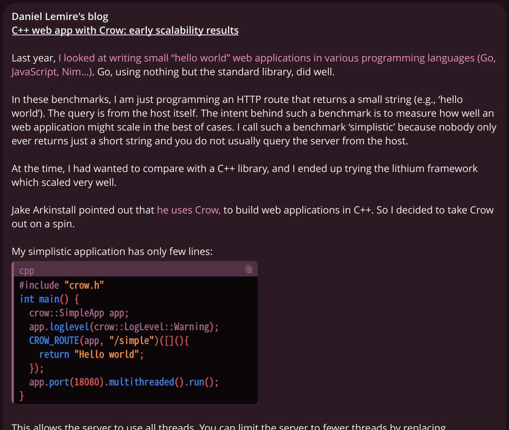
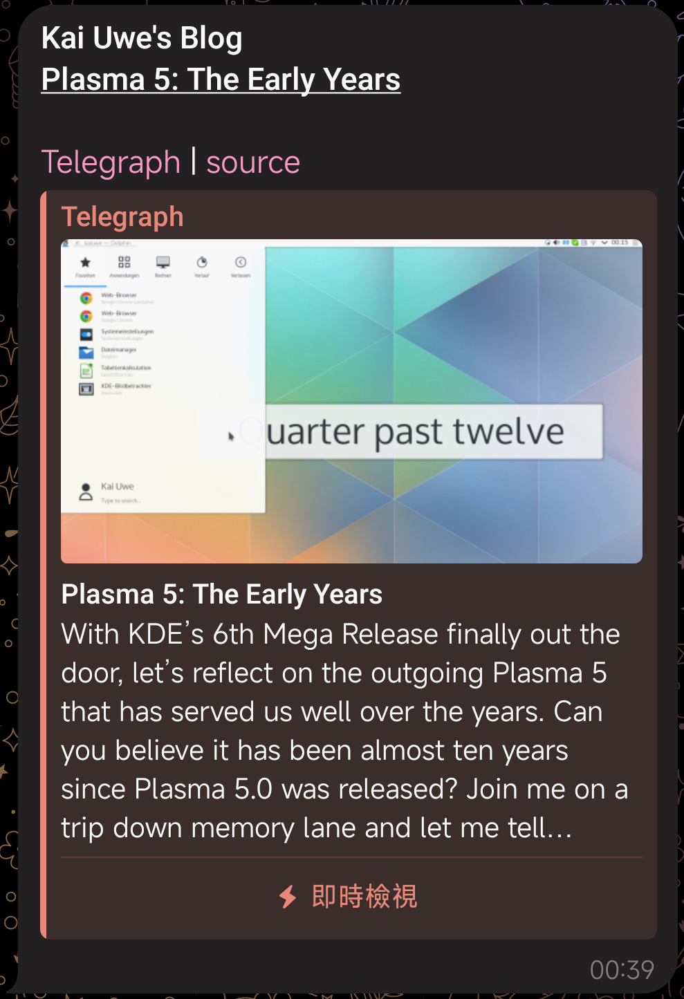
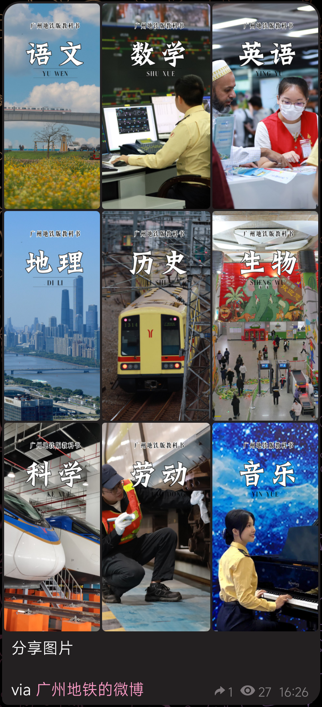
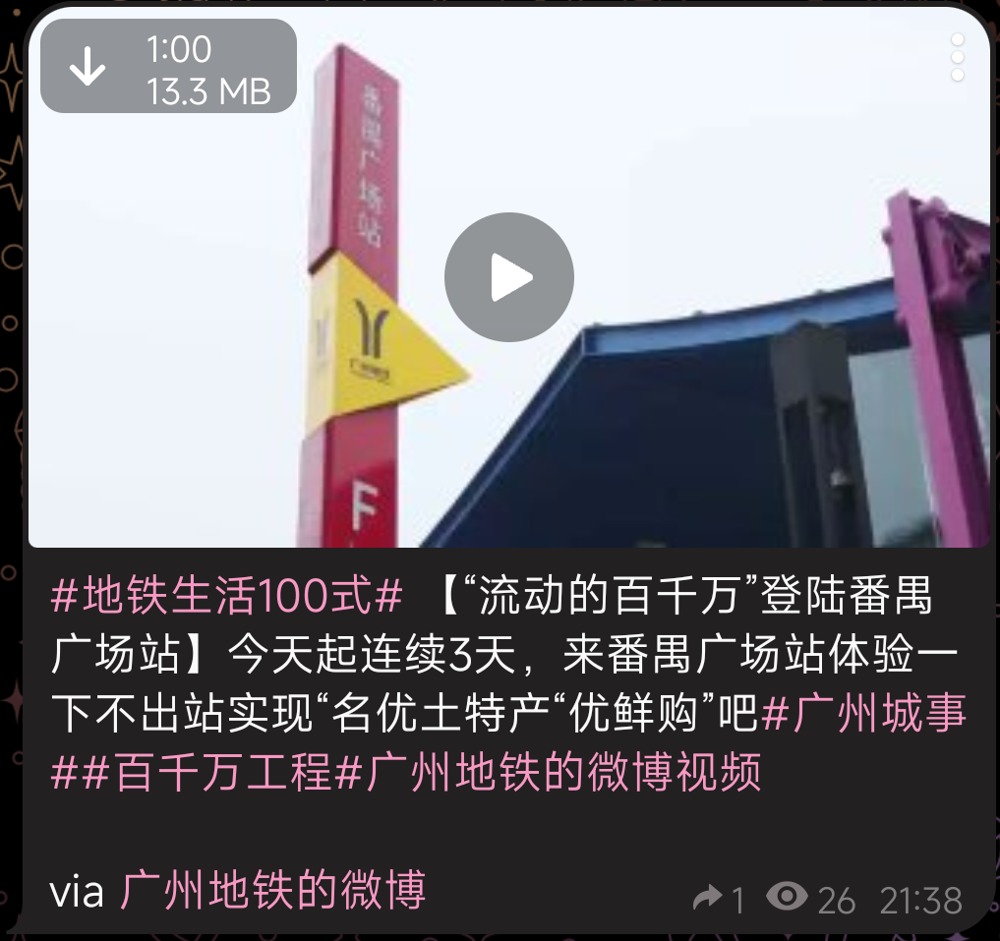

<h1 align="center">RSS to Telegram Bot</h1>

<b>关心你的阅读体验的 Telegram RSS 机器人</b>

| [English README] | [更新日志] | [FAQ] | [文档] | [使用 RSStT 的频道] |
|:----------------:|:------:|:-----:|------|:--------------:|

[English README]: README.md

[更新日志]: docs/CHANGELOG.zh.md

[FAQ]: docs/FAQ.zh.md

[文档]: docs

[使用 RSStT 的频道]: docs/channels-using-rsstt.md

<table>
    <tr>
        <td></td>
        <td rowspan="2"></td>
        <td rowspan="2"></td>
    </tr>
    <tr>
        <td></td>
    </tr>
</table>

## 亮点

- 多用户
- 国际化
    - 英语、中文、粤语、意大利语还有[更多](docs/translation-guide.md)！
- RSS 源的文章内容可被发送至 Telegram
    - 保持富文本格式
    - 保持媒体文件 (可自定义)
        - 在文章内容或者 enclosure 里的图片、视频、音频；和在文章 enclosure 里的文档
        - 长图会作为文件发送，防止 Telegram 将它压缩得不可读
        - 丢弃烦人的图标，它们破坏了阅读体验
    - 自动替换 emoji shortcodes 为 emoji
    - 自动替换满足某些特征的表情图片为 emoji 或其描述文本
    - 自动判断 RSS 源的标题是否为自动填充，并自动选择是否略去标题 (可自定义)
    - 自动显示作者名 (可自定义)
    - 自动切分超长消息
    - 消息可作为 Telegraph 文章发送 (可自定义)
- [丰富的自定义格式设定](docs/formatting-settings.md)
    - Hashtag、自定义标题，等等
- 为 Telegram 和 RSS 源配置独立的代理设置
- OPML 导入和导出 (保持自定义标题)
- 自定义订阅
- 优化的性能 (参见 [FAQ](docs/FAQ.zh.md#q-bot-的性能怎么样))
- 用户友好
- HTTP 缓存

## 部署

\

\

[&logo=pypi&logoColor=white)](https://github.com/Rongronggg9/RSS-to-Telegram-Bot/actions/workflows/publish-to-test-pypi.yml)

部署 RSStT 实例非常简单。最推荐的部署方式是 Docker Compose: 它适合几乎所有 VPS。[Railway.app](https://railway.app) (一个 PaaS 平台) 也得到了官方支持。您也可以使用 pip 从 [PyPI](https://pypi.org/project/rsstt/) (跟踪 `master` 分支) 或 [TestPyPI](https://test.pypi.org/project/rsstt/) (跟踪最新的 `dev` 分支) 安装 RSStT。对于开发人员或有经验的用户，从源代码直接运行也是一个选项。

详情请参阅[部署指南](docs/deployment-guide.md)。

## 翻译

在[这里](docs/translation-guide.md)阅读翻译指南。

你可以通过 [Hosted Weblate](https://hosted.weblate.org/projects/rss-to-telegram-bot/) 帮助翻译这个 bot。特别感谢他们为自由项目提供的免费托管服务！

## 使用公共 bot

[公共 bot](https://t.me/RSStT_Bot) 没有服务保障。我会尽我所能维护它，但不能保证它永远完美运作。同时，你应该遵循“公平使用”，避免订阅过多 RSS 源。\
如果你在频道里使用[公共 bot](https://t.me/RSStT_Bot) ，请考虑在频道简介 (或置顶消息) 里提及这个 bot (或这个项目)，来让更多人了解本项目。这不是强制的。

## 使用 RSStT 的频道

想要预览 RSStT 发送的消息的模样吗？这里有一个[使用 RSStT 的频道列表](docs/channels-using-rsstt.md)

## 许可

本项目按 [AGPLv3+](LICENSE) 许可。严禁闭源的分发或机器人托管。如果你分发或托管本项目时带有代码修改，请确保源代码对任何可以使用该 bot 的用户来说均是可取得的 (通过在 [`src/i18n/__init__.py`](src/i18n/__init__.py) 中编辑仓库 URL)。

    RSS to Telegram Bot
    Copyright (C) 2020-2024  Rongrong <i@rong.moe>

    This program is free software: you can redistribute it and/or modify
    it under the terms of the GNU Affero General Public License as
    published by the Free Software Foundation, either version 3 of the
    License, or (at your option) any later version.

    This program is distributed in the hope that it will be useful,
    but WITHOUT ANY WARRANTY; without even the implied warranty of
    MERCHANTABILITY or FITNESS FOR A PARTICULAR PURPOSE.  See the
    GNU Affero General Public License for more details.

    You should have received a copy of the GNU Affero General Public License
    along with this program.  If not, see <https://www.gnu.org/licenses/>.

本仓库是在 2020 年从 [BoKKeR/RSS-to-Telegram-Bot](https://github.com/BoKKeR/RSS-to-Telegram-Bot) 分叉 (fork) 出来的。自 2021 年的某个时间起，它们不再具有共同的代码库，应当被视为完全不同的项目。
