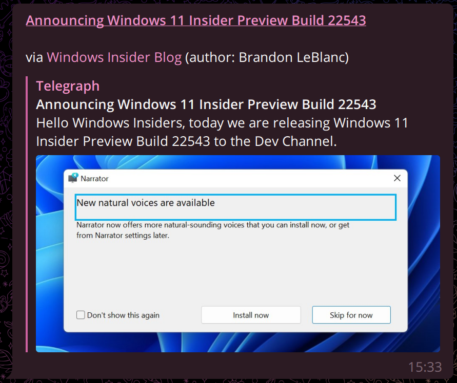

# [RSS to Telegram Bot](https://t.me/RSStT_Bot)

**关心你的阅读体验的 Telegram RSS 机器人**

[English README](README.md)

<a href="https://t.me/RSStT_Bot"><a/>

|  [更新日志]  |  [文档]  | [使用 RSStT 的频道] |
|:--------:|:------:|:--------------:|

[更新日志]: docs/CHANGELOG.zh.md

[文档]: docs

[使用 RSStT 的频道]: docs/channels-using-rsstt.md

| [![Deploy on Railway][railway_button]][railway_guide] | [![Deploy to Heroku][heroku_button]][heroku_guide] |
|:-----------------------------------------------------:|:--------------------------------------------------:|

[railway_button]: https://railway.app/button.svg

[heroku_button]: https://www.herokucdn.com/deploy/button.svg

[railway_guide]: docs/deployment-guide.md#option-2-railwayapp

[heroku_guide]: docs/deployment-guide.md#option-3-heroku

**重要**: 如果你有自己的 RSStT bot (v1)，请阅读[迁移指南](docs/migration-guide-v2.zh.md) 来了解如何迁移到 v2。

## 亮点

- 多用户
- 国际化
    - 英语、中文、粤语、意大利语还有[更多](docs/translation-guide.md)！
- RSS 源的文章内容可被发送至 Telegram
    - 保持富文本格式
    - 保持媒体文件 (可自定义)
        - 在文章内容或者 enclosure 里的图片、视频、音频；和在文章 enclosure 里的文档
        - 长图会作为文件发送，防止 Telegram 将它压缩得不可读
        - 丢弃烦人的图标，它们破坏了阅读体验
    - 自动替换 emoji shortcodes 为 emoji
    - 自动替换满足某些特征的表情图片为 emoji 或其描述文本
    - 自动判断 RSS 源的标题是否为自动填充，并自动选择是否略去标题 (可自定义)
    - 自动显示作者名 (可自定义)
    - 自动切分超长消息
        - 如果配置了 Telegraph，消息会通过 Telegraph 发出 (可自定义)
- [丰富的自定义格式设定](docs/formatting-settings.md)
    - Hashtag、自定义标题，等等
- 为 Telegram 和 RSS 源配置独立的代理设置
- OPML 导入和导出 (保持自定义标题)
- 自定义订阅
- 优化的性能 (参见 [FAQ](docs/FAQ.zh.md#q-bot-的性能怎么样它看起来有轻微的内存泄漏问题))
- 用户友好
- HTTP 缓存

## 部署

在[这里](docs/deployment-guide.md)阅读部署指南。

## FAQ

在[这里](docs/FAQ.zh.md)阅读 FAQ。

## 翻译

在[这里](docs/translation-guide.md)阅读翻译指南。

你可以通过 [Hosted Weblate](https://hosted.weblate.org/projects/rss-to-telegram-bot/) 帮助翻译这个 bot。特别感谢他们为自由项目提供的免费托管服务！

## 使用公共 bot

[公共 bot](https://t.me/RSStT_Bot) 没有服务保障。我会尽我所能维护它，但不能保证它永远完美运作。同时，你应该遵循“公平使用”，避免订阅过多 RSS 源。  
如果你在频道里使用[公共 bot](https://t.me/RSStT_Bot) ，请考虑在频道简介 (或置顶消息) 里提及这个 bot (或这个项目)，来让更多人了解本项目。这不是强制的。

## 使用 RSStT 的频道

想要预览 RSStT 发送的消息的模样吗？这里有一个[使用 RSStT 的频道列表](docs/channels-using-rsstt.md)

## 许可证

本项目使用的是 [AGPLv3 许可证](LICENSE)。严禁闭源的分发或机器人托管。如果你修改了代码并分发或托管它，请确保任何可以使用你的 bot 的用户都可以获得源代码 (通过在 [`src/i18n/__init__.py`](src/i18n/__init__.py) 中编辑仓库 URL)。
