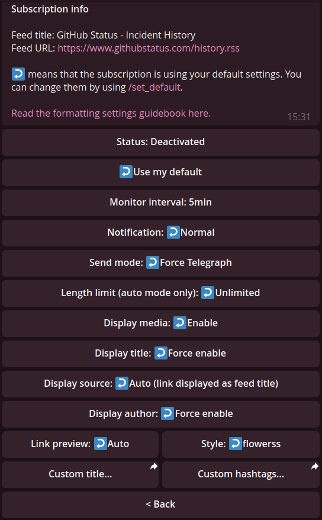

# Changelog

## Unreleased

### Enhancements

- **No longer proxies images from `*.wp.com` when generating Telegraph posts**: `*.wp.com` is in the blocklist of `wsrv.nl` (environment variable `IMAGES_WESERV_NL`). Thus, these images are no longer proxied when generating Telegraph posts. All images from `*.wp.com` can be accessed with any referer header, so they are now kept as is.

### Bug fixes

- **Canonical `DATABASE_URL` not recognized**: Since v2.9.0, `DATABASE_URL` is canonicalized before connecting to the corresponding database. However, a canonical URL pointing to a local path cannot be recognized when checking the validity of the scheme (database type). Both canonical (`scheme:/path/to/file.db`) and traditional (`scheme:///path/to/file.db`) forms of such URLs are recognized correctly now.

## v2.9.0: Telegraph-related revert, skip cert verification, and more

### BREAKING CHANGES

Media (image and video) are no longer uploaded when generating Telegraph posts due to [Telegraph disabling media upload](https://t.me/durov/343). (first introduced in v2.6.0)

### Addition

- **Disable TLS certificate verification**: The environment variable `VERIFY_TLS` has been added to disable (when set to `0`) or enable (when set to `1`, default) TLS certificate verification. This is useful when subscribing to feeds with their TLS misconfigured. Note: Disabling TLS certificate verification is not recommended and should only be used as a last resort.

### Enhancements

- **Sanitize post title and author**: The title and author of a post (RSS item or Atom entry) are now sanitized to prevent unexpected formatting issues. In particular, unexpected whitespaces and linebreaks are removed, and any HTML elements are stripped. This helps display them correctly in Telegram messages as well as Telegraph posts.
- **Improve robustness on Railway.app**: Some Railway-specific environment variables are recognized to improve robustness on Railway.app. In particular, `DATABASE_PRIVATE_URL` and `DATABASE_PUBLIC_URL` will be used when `DATABASE_URL` is unavailable or invalid. This should solve most database connection issues on Railway.app.
- **Minor refactor**: Some internal functions have been refactored to improve readability and maintainability.

### Bug fixes

- **`/version` not working**: When installed from PyPI (e.g. `pip install rsstt`), the `/version` command might cause an error. This was a regression introduced in v2.7.0.
- **Bot managers can set monitoring intervals shorter than limit**: Due to the breaking change introduced in v2.8.0, the privilege of bot managers to set intervals shorter than the minimal monitoring interval became useless. While v2.8.0 only applied this limitation when monitoring the updates of feeds, this release also applies it to the attempts by bot managers to change the monitoring interval for a subscription. Note: bot managers can always lower the minimal monitoring interval by adjusting `minimal_interval` in `/set_option` (see also [Advanced Settings](advanced-settings.md)), but doing so will also permit anyone who is able to use the bot to set shorter intervals.
- **Minor bug fixes**

## v2.8.0: Retain post order, rewritten monitor, and more

### BREAKING CHANGES

- **Minimal monitoring interval is enforced**: The minimal monitoring interval (`minimal_interval` in `/set_option`) is now applied to all subscriptions regardless of their interval set in the database. Previously, setting a minimal monitoring interval would only affect future attempts to change the monitoring interval for a subscription and would not be applied to bot managers. As a result, pre-existing subscriptions and subscriptions of bot managers escaped. The new behavior is more consistent and predictable. If you are a bot manager of a self-hosted instance and rely on the old behavior that bot managers were able to set shorter intervals than the minimal monitoring interval, you probably need to adjust `minimal_interval` in `/set_option` (see also [Advanced Settings](advanced-settings.md)).

### Highlights

- **Retain post order**: Retain the order of posts in a feed when sending them. Previously, all new posts were sent simultaneously, losing their order within the feed. Note: Posts from different feeds are still sent simultaneously, so it is expected to see them interlaced.
- **Rewritten monitor**: The feed monitor has been rewritten for flexibility and robustness. It is now more memory-efficient and can smooth out spikes in CPU usage.

### Enhancements

- **Print Telegram user info of bot**: Print the bot's Telegram user info when the bot is started. This is to help bot managers to find the bot's username and user ID when deploying the bot.
- **Minor refactor**: Some internal functions have been refactored to improve performance and maintainability.

### Bug fixes

- **Exit with 0 when disconnected**: If the bot was logged out due to a network error or Telegram DC degradation, it would exit with exit-code 0. This led to confusion when the bot was running in a container or as a service. Now the bot will exit with exit-code 100 when disconnected.
- **Unable to handle completely empty posts**: Fix `AttributeError` caused by completely empty posts. They are ignored now.
- **Minor bug fixes**

## v2.7.0: #Hashtags from post, Python 3.12 support, and more

### BREAKING CHANGES

- **Migrate to `aerich` 0.7.2**: A breaking change introduced in `aerich` (a dependency of RSStT) 0.7.x has prevented RSStT from upgrading it for a long time. A lot of effort has been made, so the migration is expected to be seamless and shouldn't break anything. However, it is encouraged to make a database backup before upgrading RSStT. If you encounter any issues due to the migration, please file a bug report.

### Highlights

- **#Hashtags from post (feed entry)**: If enabled in `/set` or `/set_default`, hashtags from posts (feed entries), merged with the custom hashtags of the feed, will be added to the message. The term "hashtags from post" refers to `<category>` elements in RSS `<item>` or Atom `<entry>`. This feature is disabled by default. Thanks [@maooyer](https://github.com/maooyer) for their first contribution in [#449](https://github.com/Rongronggg9/RSS-to-Telegram-Bot/pull/449).
- **Support Python 3.12**: Minor fixes have been made to support Python 3.12. The official Docker image is now based on Python 3.12 as well.
- **Helper scripts to make contributions easier**: When performing contributions that update database models, creating database migration files is not an easy job. [scripts/aerich_helper.py](../scripts/aerich_helper.py) is a helper script that can simplify the process. Passing `--help` to the script to see a detailed usage guide.

### Enhancements

- **Defer monitoring as per RSSHub TTL**: Defer monitoring as per the TTL (Time To Live) of feeds generated by RSSHub. RSSHub caches feed until the TTL expires, so aggressively monitoring RSSHub feeds with a long TTL is unnecessary. This aims to reduce the load of RSStT instances, as well as RSSHub instances. No delay will be applied if TTL is unavailable or less than 5 minutes. Feeds not generated by RSSHub are unaffected, considering the widespread misuse of RSS TTL.
- **Defer monitoring as per Cloudflare cache**: Ditto, but for feeds proxied by Cloudflare. If Cloudflare proxies a feed without caching it, no delay will be applied to the feed.
- **Better handling custom #hashtags**: Invalid characters and punctuations that break hashtags are now replaced with `_` (underscore) when setting custom hashtags.
- **Refine monitoring logging**: The monitoring log has been refined to be more informative and easier to read.
- **Minor refactor**: Some internal functions have been refactored to improve readability and maintainability.

## v2.6.0: Upload media to Telegraph, management enhancements

### Highlights

- **Upload media to Telegraph**: When generating Telegraph posts, images as well as videos will be uploaded to Telegraph. This is to solve anti-hotlinking issues and improve the load performance of posts. This feature depends on the latest version of the media relay server ([Rongronggg9/rsstt-img-relay](https://github.com/Rongronggg9/rsstt-img-relay)). Those images and videos that are too large to be uploaded will still be proxied by `wsrv.nl` (environment variable `IMAGES_WESERV_NL`) or media relay server (environment variable `IMG_RELAY_SERVER`). Thanks [#431](https://github.com/Rongronggg9/RSS-to-Telegram-Bot/pull/431) for inspiration.

### Addition

- **Multiple managers**: The environment variable `MANAGER` now accepts a single user ID as well as a list separated by `;`, `,`, `(space)`, `(linebreak)`, or `(tab)`. Each user in the list will be able to manage the bot **equally**.
- **Customizable error logging chat**: Previously, some error logs were always sent to the bot manager. To make it more flexible, a new environment variable `ERROR_LOGGING_CHAT`, accepting a **single** user/channel/group ID, has been added. If set, these error logs will be sent to the specified chat. Otherwise, the first user ID in `MANAGER` will be selected as default.

### Enhancements

- **Strip whitespaces in `<li>`**: Strip whitespaces (including linebreaks) in `<li>` (list item) to improve readability. Only the leading and trailing whitespaces (including linebreaks) are stripped.
- **Only set "force reply" in groups**: Only set `ReplyKeyboardForceReply` to `True` in groups. Previously, it was also set in private chats. See also "Bug fixes" below.
- **Minor refactor**: Some internal functions have been refactored to improve readability and maintainability.

### Bug fixes

- **(`/sub`) "force reply" not cleared**: Both `/sub` and `/import` set `ReplyKeyboardForceReply` to `True` to force the user to reply to the bot. However, due to a bug of Telegram, it keeps effective even if the user has made a reply, making the reply bar always reappear. Previously, a workaround has been applied to `/import` by deleting the prompt message containing `ReplyKeyboardForceReply` after the user has made a reply (see also [#170](https://github.com/Rongronggg9/RSS-to-Telegram-Bot/issues/170)). But `/sub` was forgotten at that time. Now the workaround has been applied to `/sub` too.
- **"Remote" `/lang` unavailable**: Fix a bug preventing users from using the `/lang` command "remotely".

## v2.5.0: Responsiveness improvement, tiny enhancements and fixes

### Addition

- **Set niceness for subprocesses/threads**: (Unix only) Nice subprocesses and/or threads to improve the responsiveness of the main process. This is tunable via the environment variable `EXECUTOR_NICENESS_INCREMENT`.

### Enhancements

- **HTML list support improvement**: Now `<menu>` and `<dir>` are treated the same as `<ul>` (unordered list). In addition, orphan `<li>` (list item) without a valid list parent tag are no longer ignored but treated as an item in an single unordered list.

### Bug fixes

- **Stay in topic group even when the "General" topic is closed**: Now that topic groups are not fully supported, the bot can only send messages in the "General" topic. Previously, the bot would only send an error message to the bot manager if the "General" topic is closed. Now the bot will leave the topic group, without disturbing the bot manager, if the "General" topic is closed. This is a temporary limitation before topic groups are fully supported.
- **v2.4.1 not released to PyPI**: Due to a previous mistake, v2.4.1 could not be released to PyPI. v2.5.0 fixes the mistake and is released to PyPI.

## v2.4.1: Minor enhancements, bug fixes, and Happy New Year!

### Enhancements

- **`wsrv.nl` via relay**: Try to use `wsrv.nl` (environment variable `IMAGES_WESERV_NL`) via the media relay server (environment variable `IMG_RELAY_SERVER`). This is a workaround for images from domains/TLDs banned by `wsrv.nl` or CDNs that ban `wsrv.nl`. It can hopefully reduce the frequency of seeing "invalid media" in messages since RSStT uses `wsrv.nl` heavily to convert images into formats accepted by Telegram DCs. See also [#369](https://github.com/Rongronggg9/RSS-to-Telegram-Bot/issues/369).
- **Append enclosures to Telegraph post**: Append enclosures (if any) to Telegraph post if any. Previously, enclosures can only be sent in Telegram messages, but not in Telegraph posts.
- **Dependencies update**: Bumped most outdated dependencies to the latest version. An optional dependency `isal` has been added to slightly improve the performance of entry hashing.
- **L10n update**: Localizations have been updated.
- **Misc refactoring**: Some code has been refactored to improve readability and maintainability.

### Bug fixes

- **"Remote" `/test` unavailable**: Fix a bug preventing the bot manager from using the `/test` command "remotely".
- **Resized images still too big**: Fix a bug causing images resized by `wsrv.nl` to be sometimes too big (exceed the 5MiB limitation of Telegram DC) to send.
- **Sinaimg images not parsed properly**: Fix the URL regex of Sinaimg images. It can hopefully reduce the frequency of seeing "invalid media" in messages.
- **WEBP fully fetched regardless of fetch limit**: Fix a bug causing WEBP without `Content-Length` header to be fully fetched regardless of the fetch limit.
- **Entry hashing for monitor and sub not unified**: Unify the entry hashing for monitor and sub. Previously, the entry hashing for monitor and sub is not unified, which may cause the bot to send persisting entries (posts) after a feed is subscribed for the first time.

## v2.4.0: Significant performance improvement, native blockquote and syntax highlighting

### BREAKING CHANGES

- **Drop Python 3.7 & 3.8 support**: The minimum Python version requirement is now 3.9.

### Highlights

#### Performance enhancements

- **Reuse SSL context**: Reuse SSL context as `aiohttp` does. This improves performance (reduce load average by ~40%) and reduces memory usage.
- **Lazy CookieJar**: Lazy creating CookieJar until there is really a Cookie. This improves performance (reduce load average by ~15%) and reduces memory usage.

### Additions

- **Native blockquote**: `<blockquote>` is now rendered as a native Telegram blockquote rather than a text block wrapped with horizontal rules.
- **Syntax highlighting**: `<pre>` is now rendered as a native Telegram code block with syntax highlighting, as long as the language is specified in the `class` attribute.

### Enhancements

- **Custom-title-aware OPML**: When importing and exporting OPML, the bot will try to distinguish if a feed is of a custom title, and preserve it if so.
- **`/lang` and `/test` as "remote" commands**: `/lang` and `/test` are now recognized as "remote" commands, which means you can use them in the private chat to make the operation actually apply to the channel/group you've specified in the command. Note: `/test` is only available to the bot manager.
- **`/user_info` UX enhancement**: `/user_info` now has a better UX. Note: `/user_info` is only available to the bot manager.
- **Minor enhancements**: The Docker image is now based on Debian bookworm.

### Bug fixes

- **Unexpected feed migration**: Fix a bug causing the bot to migrate feeds to a new URL unexpectedly. More specifically, the bot will now only migrate a feed if a redirection is considered permanent (HTTP status code 301 or 308).
- **WEBP sent with wrong color space**: Fix a bug causing WEBP images sent with a wrong color space.
- **Incorrect OPML format**: Fix incorrect OPML format making some RSS readers unable to import the OPML file exported by the bot.
- **Mistaken watchdog feed timing**: Fix a bug causing the watchdog to be feed at the wrong time.
- **Uncaught errors**: Fix some uncaught errors causing messages failed to be sent.

## v2.3.0: Improved performance, subscription quantity limit, and more

This is a long-awaited release. Nice to meet you again in the changelog! This is the last release that supports Python 3.7, and there will not be any patch version for the v2.3.x series. Any fixes will only be applied to the next release, which will bump the minimum Python version requirement to 3.9.

### Performance enhancements

- **Support for Python 3.11**: Released in 2022-10-24, Python 3.11 is [10–60% (on average 25%) faster](https://docs.python.org/3.11/whatsnew/3.11.html#faster-cpython) than Python 3.10. RSStT now supports Python 3.11 and the official Docker image is based on Python 3.11.
- **CPU**: Decrease the load average by ~30% (depends on the usage scenario). Thanks to a dependency migration from pure Python `fuzzwuzz` to C-extension `rapidfuzz` and a lot of performance tuning.
- **Memory**: (Docker image only) Reduce memory consumption and improve memory allocation performance by adopting `jemalloc`.
- **Multicore CPU**: If the environment variable `MULTIPROCESSING` is set to `1`, multiple processes will be started. The number of processes is equal to the cores of CPU, but the maximum is 3. One is the main process, the others (if any) are used to parse RSS feeds, etc. Note that it is only valid when there are more than 1 CPU core, otherwise only 1 process (main process) will be started. It may help improve the performance on multicore CPUs but consumes more memory. Usually you don't need to enable it. However, if there are tons of subscriptions or your VPS comes with multiple cores but the performance of each is poor, you may want to enable this feature.
- **Bandwidth usage**: Work around an [upstream (`uvloop`) bug](https://github.com/MagicStack/uvloop/issues/471#issuecomment-1136536769) that causes the bot to use too much bandwidth. Compared to previous releases, it cuts down up to 75% bandwidth usage when `uvloop` enabled.
- **Startup time**: Decrease the startup time by increasing the startup concurrency and putting some unimportant startup tasks into the background.
- **Minor enhancements**: Some internal functions have been optimized to improve performance.

### Additions

#### Highlights

- **Subscription quantity limit**: The maximum number of subscriptions per user is now configurable (default: unlimited). By using the `/set_option` command, you can set `user_sub_limit` and `channel_or_group_sub_limit`. To check or set the limit of a specific user/channel/group, use the `/user_info` command.
- **Monitor watchdog**: A watchdog has been implemented to check if the feed monitor is properly running. If not, the watchdog will exit the bot. Docker, Railway or Heroku will have it automatically restarted.

#### Other additions

- **Leave chat if been banned**: If the bot has not the permission to send messages in a channel/group, it will leave the chat.
- **`<q>` tag as quotation marks**: A `<q>` tag is now converted to quotation marks (`<q>I am a quote,</q> said Q.` -> `“I am a quote,” said Q.`).
- **New l10n**: Multiple translations have been added.

### Enhancements & bug fixes

- **Accept 4-char usernames**: You can now use the 4-char username of your channel/group in "remote" commands.
- **Ignore inline query header in commands**: Formerly, if the bot is not properly set up as an inline bot, commands would be sent with an inline query header (`@bot_username`), causing the bot not to respond. Now the bot will ignore the inline query header and respond to commands correctly.
- **Skip monitoring tasks if flood waiting**: If the bot is unable to send messages to all subscribers of a feed due to rate limit, it will skip the monitoring task for that feed once.
- **Exit gracefully**: If the bot receives SIGINT or SIGTERM, it will exit gracefully by closing the database connections first. Formerly, unclosed database connections would block the bot from exiting.
- **Encoding detection**: Fix a bug resulting in incorrect encoding detection for some feeds.
- **Drop `sr-only` elements**: Drop `sr-only` elements from the RSS feed. They are only for screen readers and should not be rendered.
- **Fix mistaken command regex**: Fix some mistaken command regexes preventing the bot from responding commands correctly.

### Minor bug fixes & changes

More unmentioned minor bugs have been fixed in the release. The changelog does not include all the changes. For more details, please refer to the [compare view](https://github.com/Rongronggg9/RSS-to-Telegram-Bot/compare/v2.2.1...v2.3.0).

## v2.2.1: Published to PyPI, HTML table converter, and more

### Additions

#### Highlights

- **Published to PyPI**: RSStT is now available on [PyPI](https://pypi.org/project/rsstt/). You may install it with `pip install rsstt`. For more details, refer to the [Deployment Guide](deployment-guide.md).
- **HTML table converter**: An HTML table converter has been implemented to convert HTML tables to images. It requires the environment variable `TABLE_TO_IMAGE` to be set to `1`, and CJK fonts to be installed. Please do note that the converter is not perfect, cannot handle rich-text formatting, may not work for all HTML tables, and can potentially lead to a higher performance cost and longer processing time.

#### Other additions

- **New l10n**: The Indonesian (`id`, Bahasa Indonesia) translation has been added.
- **Add `.env.sample`**: A sample `.env` file has been added.

### Enhancements

- **Natural sorting**: Send posts from the oldest to the newest.
- **Timed GC**: Perform a GC (garbage collection) every 10 minutes to clean up the memory.
- **Update l10n**: The Turkish (`tr`, Türkçe) translation has been updated.
- **Security**: Execute `git` outside of the shell.
- **Minor enhancements**

### Bug fixes

- **Misfired monitor job**: Increased the `misfire_grace_time` to 10s to avoid monitor jobs being misfired because of high load.
- **Deps bump**: Fixed an upstream bug preventing users from resetting all subscriptions to the user's default settings on a PostgreSQL-based instance.
- **Minor bug fixes**

## v2.2.0: Channel remote management, more formatting options, and more

### Additions

#### Highlights

- **Channel/group remote management**: Now you can manage the subscription of your channel/group in the private chat with the bot. Most commands are supported. Just send commands like `/sub @username https://exmaple.com` or `/sub -10010000000000 https://exmaple.com`. (`@username` is the channel/group's username, `@` is required; `-10010000000000` is the channel/group's ID, it must start with `-100`)
- **More custom formatting options**:
    - **Media**: You can make Telegram messages come with no media (just text) if you want (by default, they always come with media if any media is attached to the post). Also, you can make Telegram messages come with only media and metadata (no content) if you want, only when any media is attached to the post, otherwise, they will still come with the content.
    - **Link Preview**: Now you can force disable link preview for Telegram messages.
    - **Source**: More sourcing formats available. Read the detailed description in the [Formatting Settings Guidebook](formatting-settings.md).
- **Deployment to Heroku**: The bot can now be deployed to Heroku. Read the detailed description in the [Deployment Guide](deployment-guide.md).
- **User permission management**: The bot manager can now manage the permissions of the bot users by using the `/user_info` command. In this way, the bot manager can set who (user/channel/group) can use the bot, even if the multi-user mode is disabled.

#### Other additions

- **Single-column table support**: Formerly, all HTML tables were dropped from the output. Now those tables with only one column are rendered as multi-line text. Note that multi-column tables will still be dropped from the output.
- **Audio fallback for [lizhi.fm](https://www.lizhi.fm)**: Automatically fallback to the less-quality version of the audio if the higher-quality version exceeds the file size limit. Only for [lizhi.fm](https://www.lizhi.fm).

### Enhancements

- **Prettified Telegraph post**: The format of Telegraph posts is prettified. In addition, all images and videos are using the media relay server to avoid anti-hotlinking.
- **Non-HTTP hyperlinks**: Non-HTTP hyperlinks are not supported by Telegram. The bot will automatically convert them to bare URLs.
- **Enclosure cleaning**: If an enclosure with a non-HTTP URL is already included in a link in the post, it will be removed.
- **Lazy media validator**: The media validator is now lazy. It will only run if a post will be probably sent as Telegram messages. This will reduce CPU usage and network traffic.
- **Enhanced image dimension extraction**: Image dimension extraction is now faster and more flexible. If failed, the bot will try to extract the dimension using [images.weserv.nl](https://images.weserv.nl).
- **L10n update**: Turkish (Türkçe) l10n file updated. (English, Simplified Chinese / 简体中文, Traditional Chinese / 正體中文, Cantonese / 廣東話 are always up-to-date.)
- **Improved Docker build caching**: If the dependencies are not changed, no need to fetch the whole Docker image again. Just use the cached dependencies and fetch the latest source code.
- **Extract git info from Railway.app env variables**: Deployment on Railway.app can now recognize the git info.
- **Minor enhancements**

### Bug fixes

- **Python 3.7 compatibility**: The previous version of the bot broke the compatibility with Python 3.7. Now it has been fixed. Please note that only x86 and amd64 architectures are supported. For arm64, the minimum Python version requirement is 3.8.
- **EntitiesTooLongError**: Posts with tons of text hyperlinks could cause Telegram API to throw this error. Now the bot will try to fix this error by more aggressive post splitting.
- `
`: The bot will now ensure that each `
` tag takes up a whole line.
- **Unnecessary image fallback**: The bot will no longer fall back all images to file if at least one image needs to be sent as a file.
- **Web retry**: Added a need-to-retry exception.
- **Webpage decode error**: `cchardet` is not robust enough to handle all feeds. Now the bot will try to detect the encoding of the webpage according to the XML encoding declaration. Also, if `cchardet` returns a not-supported encoding, the bot will try to decode the webpage using UTF-8. Any character that cannot be decoded will be replaced with `�`.
- **Extracting image dimension from Exif thumbnail**: Some images may contain a thumbnail in the Exif data. The bot will now avoid extracting the dimension from the thumbnail.
- **Minor bug fixes**

## v2.1.0: Custom format, new l10n, improved media fallback, and more

Official public bot [@RSStT_Bot](https://t.me/RSStT_Bot) is always using the `dev` branch. If you are using it, you may have noticed the new features. Since new commands are added, please use `/lang` command once again and select your language to let the bot update your command list.

### BREAKING CHANGES

- Inline mode is now required to be enabled due to new custom settings. Go to [@BotFather](https://t.me/BotFather), send `/setinline`, select your bot, and reply with an inline placeholder you like. For example, [@RSStT_Bot](https://t.me/RSStT_Bot) is using `Please input a command to continue...`.

### Additions

#### Highlights

- **More custom formatting options**: `/set` command now gains its full power. You can control media or any metadata to be displayed or not. Adding your custom hashtags and setting your custom subscription title are all possible, but the inline mode is required to be enabled. Read the detailed description of formatting settings in the [Formatting Settings Guidebook](formatting-settings.md).
- **User's default formatting settings**: Use `/set_default` to set your default formatting settings. It applies to all your new subscriptions and if you like, you can make existing subscriptions use them. It is useful if you want to set similar settings for most of your subscriptions.

- **New l10n**: Italian (Italiano), Turkish (Türkçe), Catalan (Català), and French (français). Feel like adding your language? Please read the translation guide [here](translation-guide.md).
- **Feed sniffer**: If you try to subscribe to a webpage instead of a feed, the bot will try to sniff the feed from the webpage. (Note: this only works if the webpage contains a feed link.)
- **Enclosure support**: The bot can now extract enclosures from posts. Enjoy listening to podcasts or downloading attachments!
- **`<audio>` support**: The bot can now extract audio from post content. Enjoy listening to podcasts!
- **Send long images as files**: The bot can now send long images as files. This can prevent Telegram from compressing the image and making it unreadable.
- **OPML importing w/ custom title**: You can now import subscriptions from OPML files, without losing your custom title. The bot will ask you if the bot should use the custom titles from the OPML file or not.
- **OPML exporting w/ custom title**: You can now export your subscriptions to an OPML, without losing your custom title.

#### Other additions

- **Image validation for more formats**: The bot can now judge the validity of non-JPEG images and fall back automatically to alternative images (if any) when the image is invalid.
- **Image fallback (`srcset`)**: The bot can now fall back an image to its alternative images (``, if any) when the image is invalid.
- **Image fallback for pixiv**: The bot can now fall back an image from pixiv to its other sizes when the image is invalid. (#41)
- **Image fallback for all images**: The bot can now use images.weserv.nl to fall back an invalid image to an image valid for Telegram API.
- **Video fallback**: The bot can now fall back a video to its alternative videos (`<video><source>...</video>`, if any) or its poster (`<video poster="...">`, if any) when the video is invalid.
- **WEBP and SVG support**: The bot can now use images.weserv.nl to convert WEBP and SVG to PNG, to make them compatible with Telegram API.
- **Media uploader**: The bot now uploads media by using bare MTProto API calls, instead of using the effective method of telethon. This is to avoid unnecessary media fallback and to improve performance.

### Enhancements

- **Page number**: When a command needs to be paginated, the bot will show the current page number.
- **`/unsub_all` confirmation and backup**: When you unsubscribe from all feeds, the bot will ask you to confirm and send you a backup.
- **Cancel**: Some commands can be canceled by tapping on the `Cancel` button.
- **Custom monitor interval**: You have now more choice of monitor interval, and if you want, you can set any interval you like (need the inline mode to be enabled, note that the bot manager can prevent ordinary users from setting a too-small value).
- **Deactivating reason**: When a subscription is deactivated due to too many errors, the bot will tell you the reason.
- **Drop more icons**: Some posts have annoying icons. The bot can now detect and drop more.
- **Monitor tasks order randomization**: The order of the monitor tasks is randomized.
- **Retry when Telegram internal error occurs**: When Telegram internal error occurs, the bot will retry to send the message.
- **Rewritten post parser**: The post parser is rewritten to be more flexible and gain the ability to support custom formatting.
- **Rewritten rich-text splitter**: The rich-text splitter is rewritten to be more stable, flexible and gain the ability to support custom formatting. This also prevents it from prematurely splitting the text.
- **Command speedup**: Some commands are now faster.
- **`/test` formatting**: The `/test` command now uses the user's default formatting settings or the formatting settings of the feed (if subscribed). (Note: only the bot manager can use this command.)
- **Minor enhancements**

### Bug fixes

- **Feed title not updated**: When a feed updates its title, the bot will now update the title in the DB and send messages with the new title.
- **Content too long**: Those commands that may contain long content now will be either shortened or paginated. If still too long, the bot will prompt you.
- **Too many entities**: The bot now ensures that the number of formatting entities in a message is not greater than 100 (Telegram API limit), otherwise a split is made. This is to prevent messages from losing their formatting.
- **Potential deadlock**: A potential deadlock issue has been fixed.
- **Improper white-space and linebreak policy**: The bot can now avoid unintended white spaces and linebreaks in messages, especially for weird feeds. This also applies to the feed/post title and post author.
- **Minor bug fixes**

## v2.0.0: Multi-user, i18n, improved user-friendliness, and more

Official public bot: [@RSStT_Bot](https://t.me/RSStT_Bot)

**This is a major release. It introduces some major breaking changes. You must migrate to the new version manually.**\
**PLEASE READ THE [MIGRATION GUIDE](migration-guide-v2.md) BEFORE UPDATING!**

### BREAKING CHANGES

- User and subscription management has been rewritten. The bot now can be used by multiple users and each subscription may have its individual monitoring interval. Thus, env variables `CHATID` and `DELAY` are deprecated and of no use.
    - The default behavior is to run as a multi-user bot. If you still would like to limit the bot to serve you only, follow the [migration guide](migration-guide-v2.md).
- Redis support has been dropped. Only SQLite and PostgreSQL are supported.

### Additions

#### Highlights

- **Multi-user**: The bot can be used by any users, or in channels and groups (unless env variable `MULTIUSER` is set to `0`).
- **I18n**: The bot now supports multiple languages. Currently, <ins>English (en)</ins>, <ins>Simplified Chinese (简体中文, zh-Hans)</ins> and <ins>Cantonese (廣東話, yue)</ins> are supported. You can contribute by translating the bot to your language following the [translation guide](translation-guide.md).
- **User-friendly**: You can use most commands interactively, no need to remember their syntax.
- **HTTP Caching**: The bot has implemented the necessary parts of [RFC7234](https://datatracker.ietf.org/doc/html/rfc7234) to "cache" feeds. It can reduce the servers loads of both the bot and the feed provider.

#### Other additions

- **Customizing subscriptions**: Subscriptions can be customized. Currently, only the settings below can be customized. Other settings are WIP.
    - **Pausing**: You can deactivate a subscription. In this way, you can make the bot pause to send updates of it.
    - **Muting**: You can mute a subscription. In this way, when the bot sends updates of it, silent messages will be sent. (You will still receive notifications, but no sound.)
    - **Interval**: You can change the monitoring interval of a subscription.
- **Documentation**: The bot now has documentation. You can find it at [docs]().

### Enhancements

- **Better feed history management**: All posts in a feed are now hashed and stored. This allows you to subscribe to almost any feeds without missing posts.
- **Better error handling**: The bot now has better error handling. It will now try to recover from errors and retry.
- **Better logging**: The bot now has better logging.
- **Better performance**: The bot now has a better performance.
- **Dependence bump**: Dependencies have been bumped to the latest version. Potential security vulnerabilities have been fixed.
- **Proxy bypassing**: If env variable `PROXY_BYPASS_PRIVATE` is set, the bot will bypass proxy for private IPs. And will bypass proxy for domains listed in env variable `PROXY_BYPASS_DOMAINS`.
- **Bugfixes**: A few bugfixes.

## v1.6.1: Rushed release to fix login

**This is a rushed release. It bumps the dependency `telethon` to the latest version. Please upgrade to this version immediately to avoid being unable to login due to the outdated dependency.**

The bot is currently being actively developed on the `multiuser` branch but has not been merged back yet to avoid introducing breaking changes too early. If you would like to try the multi-user version, there is a public demo [@RSStT_Bot](https://t.me/RSStT_Bot).

### Additions

- `.env` file support (only for manual execution, not for docker)
- Unescape HTML-escaped post title
- Use the title as the content of a post if the latter is of no text

### Enhancements

- Minor bug fixes
- Introduce some workarounds to avoid being flood-controlled frequently
- Introduce some deps to speed up HTTP requests

## v1.6.0: Switching to MTProto, OPML support, and more

### BREAKING CHANGES

- The telegram bot library has been migrated from `python-telegram-bot` (which uses HTTP Bot API and is synchronous) to `telethon` (which uses MTProto Bot API and is asynchronous)
    - However, to use MTProto Bot API, an API key is needed. The bot has 7 built-in API keys (collected from the Internet) and in most cases, it should not be unable to log in. But if so, please obtain your own API key
      (see [docker-compose.yml.sample](https://github.com/Rongronggg9/RSS-to-Telegram-Bot/blob/53f11a4739/docker-compose.yml.sample#L43) for details)

### Additions

- Thanks to the migration of the Telegram bot library, the bot can now connect to its DC directly, need not detour through the HTTP Bot API, and keep polling to get new messages. Which makes the bot receive and reply to messages more rapidly and lightweight. Even if the HTTP Bot API is down, the bot can still run unaffectedly.
  (more details: [Advantages of MTProto over Bot API](https://docs.telethon.dev/en/latest/concepts/botapi-vs-mtproto.html#advantages-of-mtproto-over-bot-api), [MTProto vs HTTP Bot API](https://github.com/LonamiWebs/Telethon/wiki/MTProto-vs-HTTP-Bot-API))
- Support parsing more HTML elements
    - `<iframe>`
    - `<video><source><source>...</video>`
    - `<code>`
    - `<pre>`
- Support OPML importing and exporting
- Support sending too-long post via Telegraph (env variable `TELEGRAPH_TOKEN` must be set)
- Support using Redis as DB
    - Note: This is a workaround for deploying the bot on [railway.app](), will be dropped in the future
- Support arm64 (docker build)
- Support resending a message using a media relay server if Telegram cannot send a message with media due to Telegram server instability or network instability between the media server and Telegram server
- Support colored logging
- `docker-compose.yml.sample`
- `/version` command to check bot version
- Automatically use proxy if global proxy (env variable `SOCKS_PROXY`/`HTTP_PROXY`) set

### Enhancements

- Assign feed monitoring tasks to every minute, instead of executing all at once each `DELAY`
    - Thus, env variable `DELAY` can only be 60~3600
    - Note: env variable `DELAY` will be deprecated in the future
- Recognize a post by its `guid`/`id` instead of `link`
- Simplify the output of `/list`
- Bump Python to 3.9 (docker build)
- Minor fixes

## v1.5.0: Complete rewrite of the post parser

- The Post parser is completely rewritten, more stable, and can keep text formatting as much as possible
- GIF Support
- When the message is more than 10 pieces of media, send it in pieces
- Support video and pictures to be mixed in the same message arbitrarily
- Invalid media are no longer directly discarded, but attached to the end of the message as a link
- Automatically determine whether the title of the RSS feed is auto-filled, if so, omit the title
- Automatically show the author-name
- Automatically replace emoji shortcodes with emoji
- Automatically replace emoji images with emoji or its description text
- When an image cannot be sent due to the instability of telegram API, the image server will be automatically replaced and resent
    - Only for Weibo images, non-Weibo images will be attached to the end of the message as a link
- Improve the text length counting method, no longer cause the message to be divided wrongly due to a long link URL
- Change the user-agent, because some websites have banned the UA of Requests
- Logging improvement

## v1.0.0: Initial release

initial public release
