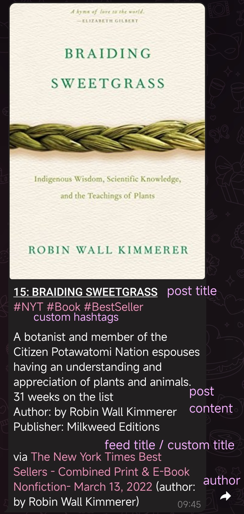
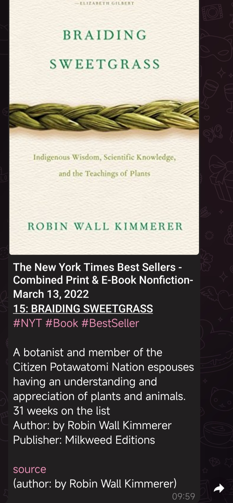
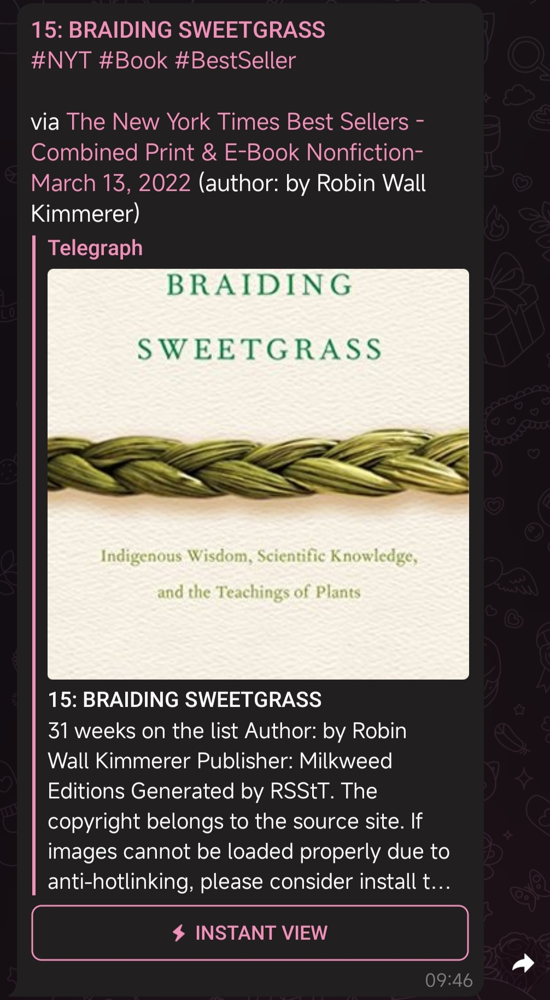
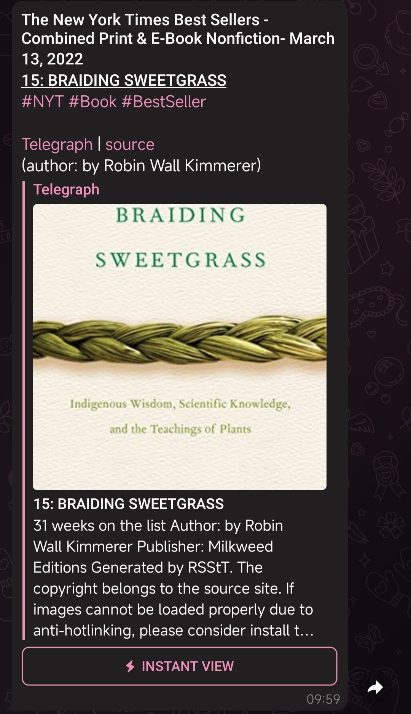
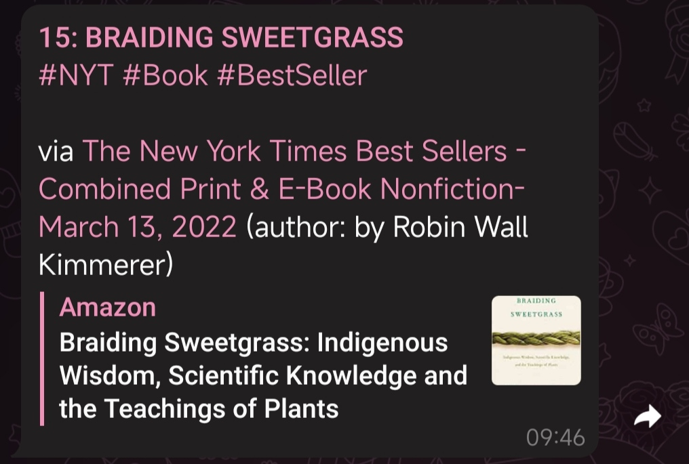
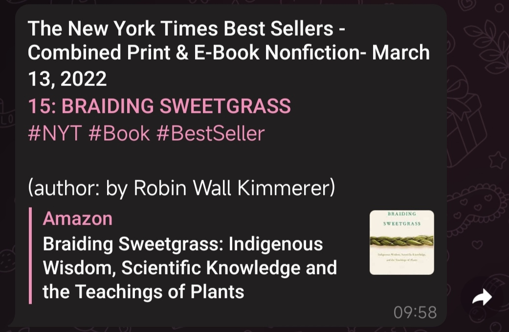

# Formatting Settings Guidebook

[//]: # (![img.png]&#40;resources/formatting.png&#41;)

## Option description

> Underlined options are the default.

- **Status**:
    - **<ins>Activated</ins>**: follow updates
    - **Deactivated**: pausing
- **Monitor interval**:
    - A positive integer >= 1. _(note that the bot manager can prevent ordinary users from setting a too-small value)_
    - <ins>The default value depends on the bot manager's settings.</ins>
    - The interval between monitoring.
- **Notification**:
    - **<ins>Normal</ins>**: notify w/ sound
    - **Muted**: notify w/o sound
- **Send mode**:
    - **<ins>Auto</ins>**: auto choosing the three modes below according to the content length and the number and type of media. _If a post can be sent in a single **Telegram message**, it will be sent as a single message. Otherwise, send it as a **Telegraph** post. However, if still too long, **only its title and source** will be sent._
    - **Force Telegram messages**: send a post as Telegram messages containing its title, content, and source, no matter how long it is _(note that if a post is too long, it can be a huge flood of messages)_
    - **Force Telegraph**: send a post as a Telegraph post, no matter how long it is _(note that if the post is too long for Telegraph, fall back to **only title and source**)_
    - **Only title and source**: send a post as a Telegram message containing only its title and source, w/o its content, no matter how long it is
- **Length limit**:
    - A positive integer between [<ins>0</ins>, 4096]. <ins>0</ins> means "unlimited", actually equivalent to 4096 due to the internal limitation of Telegram (4096 characters for pure text messages; 1024 characters for text messages with media; some media types cannot be mixed with some others).
    - It is only effective when **send mode** is **auto**. Even if a post can be sent in a single Telegram message, but exceeding this limit, it has to be sent as a Telegraph post. Useful when you prefer Telegraph posts more than Telegram messages but still prefer receiving very short posts as Telegram messages. _Note that the media of a post will affect the internal limitation of Telegram, so it is possible that the length limit is not exceeded but the post is still too long for Telegram._
- **Media**:
    > Note that the option is only effective when **send mode** is **auto** or **force Telegram messages**
    - **<ins>Enable</ins>**: including media in Telegram messages (if any media is attached)
    - **Disable**: send pure-text Telegram messages, no matter whether media is attached or not
    - **Only media, no content**: if any media is attached, send it as a Telegram message containing only its media, no post content (title, source and author are still here unless you've disabled them explicitly). Otherwise, the post is simply ignored. You may want to switch the **send mode** to **force Telegram messages** also.
- **Post title**:
    - **<ins>Auto</ins>**: display the post title only when it is not auto-filled _(e.g., some routes of [RSSHub](https://github.com/DIYGod/RSSHub) will autofill the title)_
    - **Enable**: always display post title _(the post must have a title)_
    - **Disable**: never display post title
- **Source**:
    - **<ins>Feed title and link</ins>**: display a link to the post and the feed title. If **style** is **RSStT**, they will be displayed together as a text link at the end of the message. _(note that if the link does not exist, only the feed title will be displayed)_
    - **Feed title and link displayed as post title**: display the link and post title together as a text link at the beginning of the message, but not to omit the feed title _(note that if the link does not exist, only the post title will be displayed)_
    - **No feed title, link displayed as post title**: display the link and post title together as a text link at the beginning of the message, omitting the feed title _(note that if the link does not exist, fall back to **completely disable**)_
    - **No feed title, hyperlink at the end**: display a text hyperlink to the post at the end of the message, just like [`source`](https://git.io/RSStT) _(note that if the link does not exist, fall back to **completely disable**)_
    - **No feed title, bare URL at the end**: display a bare URL to the post at the end of the message, just like [`https://git.io/RSStT`](https://git.io/RSStT) _(note that if the link does not exist, fall back to **completely disable**)_
    - **Completely disable**: do not display anything about the source
- **Author**:
    - **<ins>Auto</ins>**: display author name if it is not fully contained in the feed title
    - **Enable**: always display author name _(the post must have an author)_
    - **Disable**: never display author-name
- **Link preview**:
    - **<ins>Auto</ins>**: enable Telegram link preview when a post is sent as a Telegraph post or only its title and source are sent as a Telegram message
    - **Enable**: always enable Telegram link preview _(note that a message containing media does not support link preview)_
    - **Disable**: always disable Telegram link preview
- **Style**:
    - **<ins>RSStT</ins>**: the default message style of RSS to Telegram Bot
    - **flowerss**: a style that looks like [flowerss](https://github.com/indes/flowerss-bot)
- **Custom title**: custom subscription title, overrides the feed title
- **Custom hashtags**: custom subscription hashtags, will be inserted after the post title

## Subscription formatting settings vs. User's default formatting settings

- `/set` command modifies the subscription formatting settings, it will override the user's default formatting settings. All options above are included in this command.
- `/set_default` command modifies the user's default formatting settings, it will be applied to all new subscriptions. You may reset the formatting settings of your subscriptions at any time to make them use the default settings. All options above, excluding **status**, **custom title**, and **custom hashtags**, are included in this command.
- If you would like to apply similar settings to most of your subscriptions, it is very useful to set your default formatting settings in the `/set_default` command.
- The "user's" default formatting settings are only effective chat-wide. This means that different chats have their own default formatting settings even if they share the same owner. You may set up multiple groups/channels with different default formatting settings, which is useful when you want to have different formatting settings for different subscription categories.

## Style examples

|                       |              RSStT              |              flowerss              |
|:---------------------:|:-------------------------------:|:----------------------------------:|
|   Telegram message    |   |   |
|       Telegraph       |  |  |
| Only title and source |     |     |
